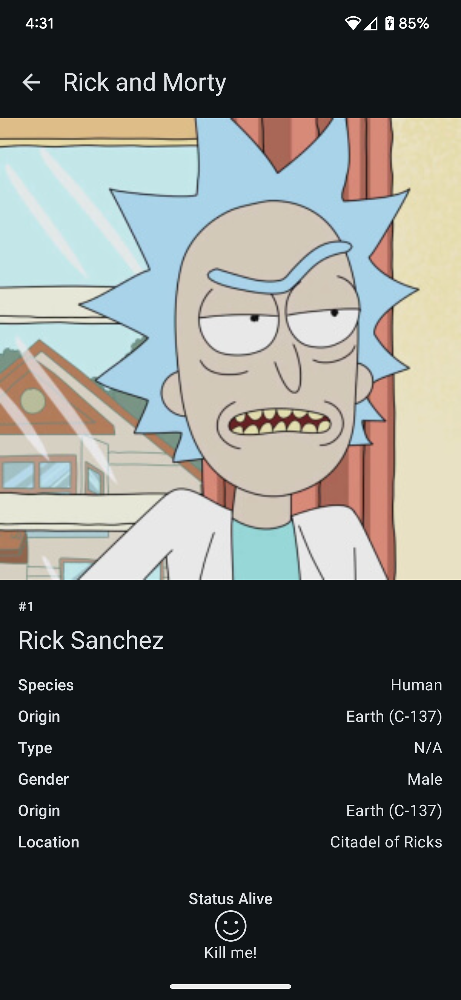
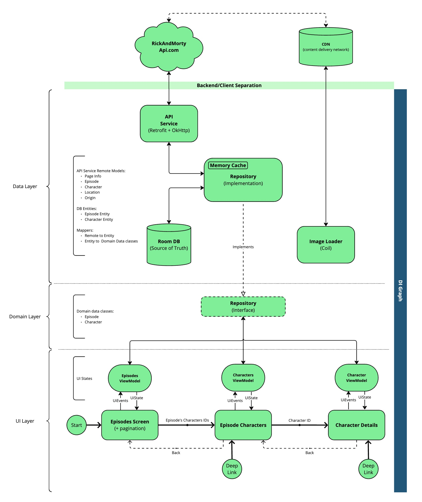
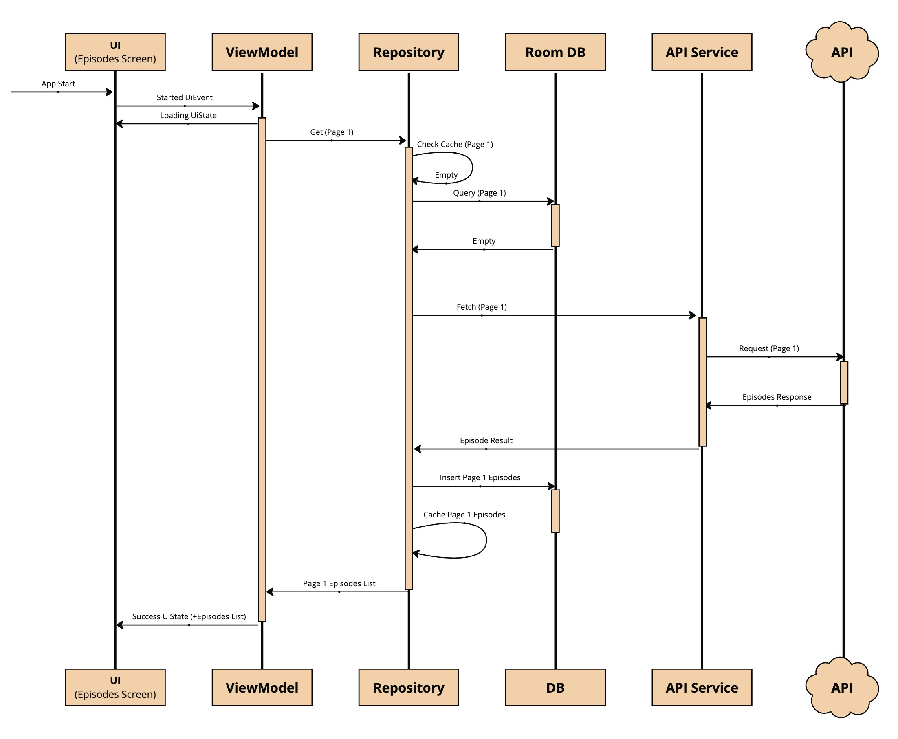

#  Rick and Morty [](https://github.com/mohsenoid/Rick-and-Morty/actions/workflows/android.yml) [](https://codecov.io/gh/mohsenoid/Rick-and-Morty) [](https://www.codefactor.io/repository/github/mohsenoid/rick-and-morty)

This repository houses my **Rick and Morty** Android application, serving as a personal pet project for training and enhancing my Android development skills.

## User Stories

1. **View Episode List**: As a user, I want to see a list of all available episodes upon launching the app, so I can easily browse and select an episode to explore.
2. **Explore Episode Characters**: When I tap on an episode in the episodes list view, I want to see a list of characters featured in that episode, with a clear visual indication of whether each character is alive or dead, so I can quickly identify their status.
3. **View Character Details**: When I tap on a character in the characters list view, I want to view their detailed information, including a picture, so I can learn more about them.
4. **Interact with Characters**: As a user, I want to have the ability to "kill" a character. When a character is killed, the character lists in relevant episodes should update accordingly, reflecting their changed status.


## Functionality

The app consists of three main compose screens, designed to provide a seamless user experience for exploring the Rick and Morty universe.

### 1. Episodes List
   **Purpose**: Presents a paginated list of all episodes, allowing users to easily browse and discover content.
   **Data Handling**: Fetched episodes are stored in the database's episodes table page by page.


### 2. Episode's Characters List
   **Purpose**: Displays a list of characters featured in the selected episode. Characters are clearly marked as alive or dead by the card background color, including those "killed" by the user.
   **Data Handling**: Character data is retrieved from the network and stored in the database's characters table. Updates to character information preserved as "isKilled" status, maintaining user interactions.


### 3. Character Details
   **Purpose**: Provides in-depth information about a selected character, including their picture and status (alive, dead, or "killed by user").
   **Data Handling**: Leverages the character data stored in the database to present a comprehensive character profile.




## Building the Project

To get started with the Rick and Morty Android application, follow these simple steps:

1. **Clone the Repository**: Clone this repository to your local machine using your preferred Git client or by downloading the source code as a ZIP file.
2. **Open in Android Studio**: Open the project in [the latest Android Studio](https://developer.android.com/studio). The IDE should automatically sync the project and resolve dependencies.
3. **Run the App**: Once the project is synced, click the "Run" button (green triangle) in the toolbar to build and launch the app on an emulator or a connected Android device.

Alternatively, you can build the project from the command line using the Gradle task:

```bash
  ./gradlew build
```


## Running Tests and Checks

This project includes unit tests and other quality checks to ensure code correctness and maintainability. To execute the full check, use the following Gradle task:

```bash
  ./gradlew check
```


## Generating Test Coverage Report

To generate a detailed test coverage report, use the following command:

```bash
  ./gradlew createDebugUnitTestCoverageReport
```

The generated report can be found at:

```
  app/build/reports/coverage/test/debug/index.html
```

## Technical details

The **Rick and Morty** Android application is built with a strong emphasis on software engineering best practices, ensuring a robust, maintainable, and scalable codebase.

### Architecture & Design Patterns



* **Clean Architecture**: The project adheres to the principles of Clean Architecture, promoting _separation of concerns_ and _testability_. The code is organized into distinct layers (_Data_, _Domain_, and _Presentation_) with well-defined responsibilities.
* **SOLID Principles**: The application follows _SOLID_ principles (Single Responsibility, Open/Closed, Liskov Substitution, Interface Segregation, Dependency Inversion), leading to a more flexible and adaptable codebase.
* **MVVM Pattern**: The Model-View-ViewModel (_MVVM_) pattern is employed to structure the presentation layer, providing a clear separation between UI logic and business logic.

### Data Layer

* **Remote API Service**: The app utilizes _Retrofit_ and _OkHttp_ to interact with [the Rick and Morty API](https://rickandmortyapi.com/), enabling efficient retrieval of remote data.
* **Local Database**: _Room_ database library is used to cache and store data locally, allowing offline access and improved performance.

### Domain Layer


* **Repositories**: The Domain layer defines repositories (`EpisodesRepository`,  `CharactersRepository`)  as interfaces, providing an abstraction layer for accessing data from various sources (network, database), implemented in the data layer.
* **Kotlin Coroutines**: _Kotlin Coroutines_ are leveraged to handle asynchronous operations (network calls, database IO interactions) in a concise and efficient manner, primarily using the IO dispatcher for background tasks.

### Presentation Layer (View)

* **Jetpack Compose**: The user interface is built entirely with Jetpack Compose, Google's modern declarative UI toolkit, offering a more intuitive and flexible way to create dynamic and engaging user experiences.
* **Compose Navigation**: Compose Navigation is used to manage navigation between different screens within the app, providing a seamless and fluid user flow all in a single `MainActivity`.




### Dependency Injection (DI)

* **Koin**: _Koin_ is the chosen dependency injection framework, simplifying the management of object dependencies and promoting code testability.

### Testing & Quality Assurance

* **Unit Tests**: The codebase is extensively covered by unit tests, written using the _MockK_ mocking library, ensuring the correctness of individual components.
* **Compose UI Testing**: Compose UI Testing is employed providing a simulated environment for testing UI components and interactions.
* **Code Style and Static Analysis**: _Ktlint_ and _Detekt_ are utilized to enforce consistent code style and identify potential code smells, further enhancing the maintainability and quality of the codebase.
* **Continuous Integration (CI)**: _GitHub Actions_ is used to automate the build, test, and code coverage reporting processes, ensuring code quality and early detection of potential issues.
* **Code Coverage Reporting**: [Codecov.io](https://codecov.io) is integrated to track and visualize code coverage metrics, providing insights into the effectiveness of the test suite.


## License

Copyright 2020 Mohsen Mirhoseini

Licensed to the Apache Software Foundation (ASF) under one or more contributor license agreements. See the NOTICE file distributed with this work for additional information regarding copyright ownership. The ASF licenses this file to you under the Apache License, Version 2.0 (the "License"); you may not use this file except in compliance with the License. You may obtain a copy of the License at

http://www.apache.org/licenses/LICENSE-2.0

Unless required by applicable law or agreed to in writing, software distributed under the License is distributed on an "AS IS" BASIS, WITHOUT WARRANTIES OR CONDITIONS OF ANY KIND, either express or implied. See the License for the specific language governing permissions and limitations under the License.
