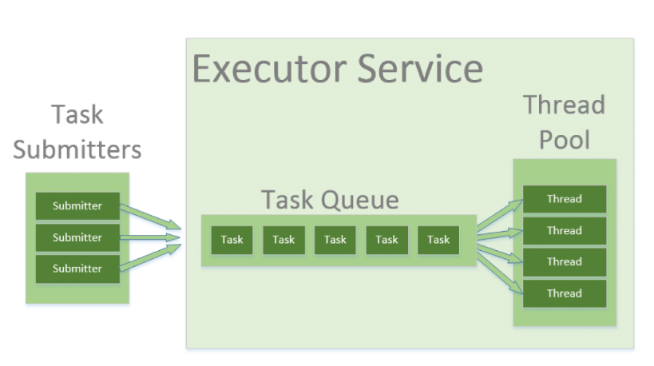

#  Rick and Morty  

This repository contains [**Guestlogix**](http://www.guestlogix.ai/) assignment Android application. [_Here is the assignment full details._](TASK.md)

 

## Technical details

The Application implemented and structured based on **Clean Architecture** and **SOLID** principles best practices and the presentation layer is implemented based on the **MVP** pattern. No 3rd party dependencies are used for developing this app and it only depends on **Android Jetpack** native libraries.

The **Data** layer contains **API Client** to get access to remote data and **DB** to persist those data locally in case of offline usage.

The **Domain** layer consist of **Repository** which allows access to the Data layer. It also uses **IO Task Executor** and **Main Task Executor** to run long-running tasks in the background and reflect the result on UI. **IO Task Executor** is implemented using java **thread pools** and **Main Task Executor** uses Android main looper **Handler**. There is also a **Test Task Executor** which runs immediately on same thread in unit tests.

The **View** layer multiple Activity and Fragment which use their contract to implement the view interface and use presenter to respond to user interactions.

The  **Dependencies Provider** does the Dependency Injection in the whole app. It also uses **Base** objects to inject dependencies into **Activities** and **Fragments**.

The **Image Downloader** also takes care of loading and caching images.

[**GitHub Actions CI service**](https://github.com/mohsenoid/mobile-take-home/actions) is running the repo test and build Gradle tasks and **jacoco** plugin generates and submit the code coverage reports to [**codecov.io**](https://codecov.io/gh/mohsenoid/mobile-take-home).

There are some unit tests using **Mockito** and some Android tests using **Robolectric**.

## References

Data provided by [Rick And Morty API](https://rickandmortyapi.com/)

Endless Recycler View made by [@nesquena](https://gist.github.com/nesquena/d09dc68ff07e845cc622)

App Launcher Icon made by [freepngimg.com](http://freepngimg.com)

Dead/Alive Icons made by [Freepik](https://flaticon.com/authors/freepik) from [flaticon.com](https://flaticon.com)