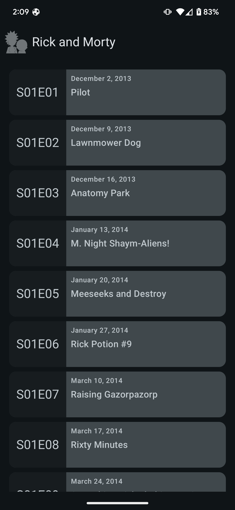

#  Rick and Morty  

This repository contains Rick and Morty Android application which I am using as training material.

 

## User Stories

1. The first thing a user should see is a list of episodes.
2. If the user taps into an episode the app has to display a list of characters with a clear distinction between dead and alive characters
3. If the user taps into a character the app has to display that character's picture and information.
4. The user should have the ability to kill a character and if a character gets killed the character lists should update accordingly

## Functionality

The app is composed of 3 main screens:

### Episodes List

It allows you to list episodes in pages. Network results are kept in the database in the `episodes` table. Each time a new page is fetched, the same `episode` record in the database is updated with the new data.

### Episode's Characters List

Shows you the list of episode characters. Network results are also kept in the database in the `characters table`. Each time a new character is fetched, the same `character` record in the database is updated with the new data and we make sure we don't override *is killed by user* data.

### Character Details

This screen displays the details of a character and if *is killed by the user*.

## Building

You can clone and open the project in Android studio and press run!

## Testing

The project uses local unit tests that run on your computer. To run those tests and generate a coverage report, you can run:

	./gradlew jacocoReport

***NOTE:*** You can find the tests report in `app/build/reports/jacoco/jacocoReport/html/index.html` 

## Technical details

The Application implemented and structured based on **Clean Architecture** and **SOLID** principles best practices and the presentation layer is implemented based on the **MVP** pattern.

The **Data** layer contains **Network Client** implemented by *Retrofit* library to get access to remote data on [Rick And Morty API](https://rickandmortyapi.com/) and **DB** implemented by *Room* library to cache and persist those data locally in case of offline usage.

The **Domain** layer consists of a **Repository** which allows access to the Data layer. It also uses *Kotlin Coroutines* **IO** and **Main** *dispatchers* to execute long-running tasks in the background and reflect the result on UI. There is also a **Test** *dispatcher* that executes tasks immediately on the same unit test thread.

The **View** layer is done with the [Android Navigation Component](https://developer.android.com/guide/navigation) including one MainActivity which holds the navigation host fragment and 3 different Fragments which uses their contract interfaces to implement the *view* and *presenter* for responding to user interactions.

The **Koin** library does the *dependency injections* in the whole app. It also uses **Base** objects to define scopes and inject dependencies into **Activities** and **Fragments**.

[**GitHub Actions CI service**](https://github.com/mohsenoid/Rick-and-Morty/actions) is running the repo tests and build Gradle tasks and **jacoco** plugin generates and submits the code coverage reports to [**codecov.io**](https://codecov.io/gh/mohsenoid/Rick-and-Morty).

Code is covered by unit tests implemented using **Mockito** and **Kluent**. Also, some Android tests using **Robolectric**.

## Libraries

- **Timber** logger library made by [Jake Wharton](https://github.com/JakeWharton/timber)
- **Picasso** image downloading and caching library made by [square](https://github.com/square/picasso)
- **Retrofit** and **OkHttp** API libraries made by [square](https://github.com/square/retrofit)
- **Kotlin Serialization** plugin made by [jetbrains](https://github.com/Kotlin/kotlinx.serialization)
- **Koin** dependency injector library made by [InsertKoinIO](https://github.com/InsertKoinIO/koin)
- **Kluent** assertions library made by [MarkusAmshove](https://github.com/MarkusAmshove/Kluent)

### References

- App **Launcher Icon** made by [freepngimg.com](http://freepngimg.com)

- **Dead/Alive Icons** made by [Freepik](https://flaticon.com/authors/freepik) from [flaticon.com](https://flaticon.com)

## License 

Copyright 2020 Mohsen Mirhoseini Argi

Licensed to the Apache Software Foundation (ASF) under one or more contributor license agreements. See the NOTICE file distributed with this work for additional information regarding copyright ownership. The ASF licenses this file to you under the Apache License, Version 2.0 (the "License"); you may not use this file except in compliance with the License. You may obtain a copy of the License at

http://www.apache.org/licenses/LICENSE-2.0

Unless required by applicable law or agreed to in writing, software distributed under the License is distributed on an "AS IS" BASIS, WITHOUT WARRANTIES OR CONDITIONS OF ANY KIND, either express or implied. See the License for the specific language governing permissions and limitations under the License.
